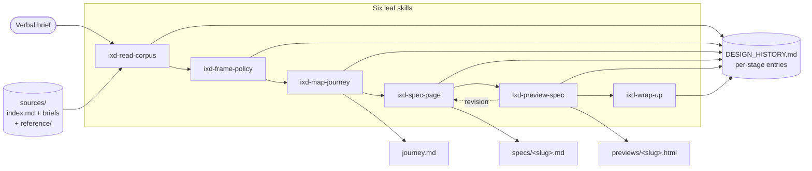
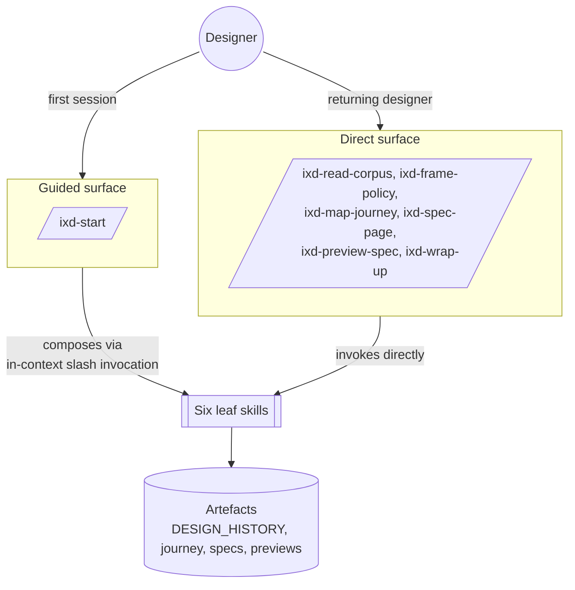
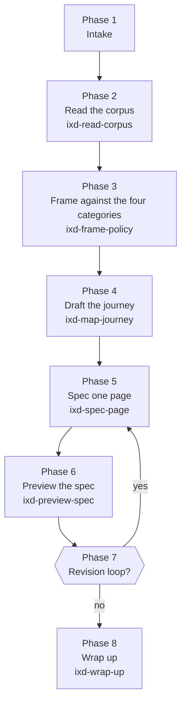
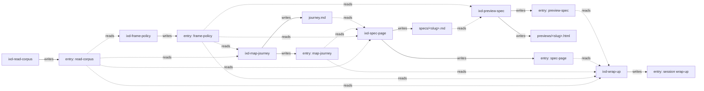
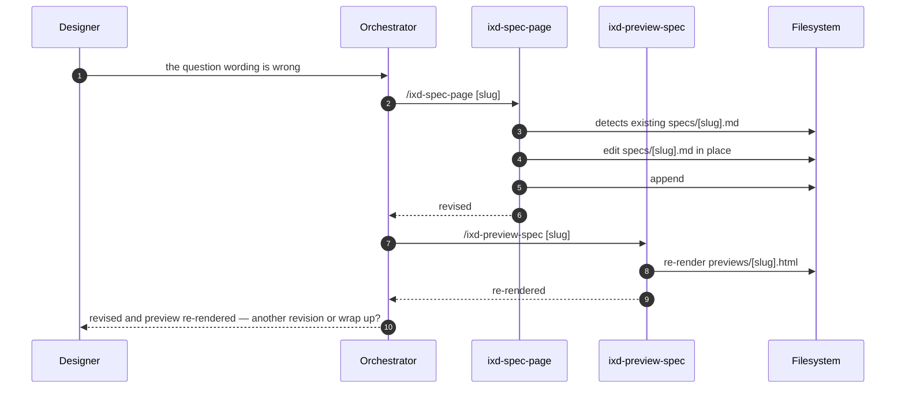
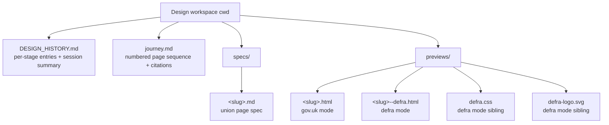

# How interaction-designer works

This plugin turns a verbal brief into a journey doc, a page spec, and a styled
HTML preview through a chain of small skills. Each skill does one job, reads the
prior skill's per-stage entry from `DESIGN_HISTORY.md`, writes its own artefact,
and appends its own per-stage entry. The orchestrator
(`/ixd-start`) is conversational glue — it does not write
artefacts; the leaves do.

This doc maps that out: the high-level shape, the eight-phase arc, the inputs
and outputs per stage, and how the two surfaces (guided vs direct) share the
same skills underneath.

## The shape at a glance

Two things to notice:

- **`DESIGN_HISTORY.md` is the spine.** Every skill reads the prior per-stage
  entries to ground, and every skill appends its own. Downstream skills never
  re-run upstream work.
- **The revision loop is a self-edge on `ixd-spec-page` → `ixd-preview-spec`.**
  Revisions edit `specs/<slug>.md` in place and append a dated sub-heading
  inside the page's existing journal entry — not a new top-level entry.

## Two surfaces, one skill layer

The orchestrator is **a curated path through the leaves**, not a separate
codepath. The artefacts produced are identical either way.

## The eight-phase arc

The guided surface walks an eight-phase arc. Each phase invokes exactly one leaf
skill (Phase 7 is the revision loop; it re-invokes `ixd-spec-page` and
`ixd-preview-spec`).

Phase 1 also runs a **pre-flight resume check** — if `DESIGN_HISTORY.md` has
per-stage entries below the last `## Session wrap-up`, the orchestrator offers
to continue from the next phase instead of starting fresh.

## Inputs and outputs per stage

The table below is the contract for each leaf skill: what it reads, what it
writes, and what it expects from the prior stage. The orchestrator just
sequences these — the contracts are the same on the direct surface.

| Phase | Skill                                                       | Inputs (reads)                                                                                                                                            | Outputs (writes)                                                                                                                              |
| ----- | ----------------------------------------------------------- | --------------------------------------------------------------------------------------------------------------------------------------------------------- | --------------------------------------------------------------------------------------------------------------------------------------------- |
| 2     | `ixd-read-corpus`                                           | `sources/index.md`; the named brief; every reference doc listed in the index                                                                              | Per-stage entry in `DESIGN_HISTORY.md` (brief path + summaries of reference docs)                                                             |
| 3     | `ixd-frame-policy`                                          | Last `ixd-read-corpus` entry; the brief file itself                                                                                                       | Per-stage entry with four sub-headings (**user / legal context / evidence / eligibility**), each holding the designer's own answer            |
| 4     | `ixd-map-journey`                                           | Last `ixd-read-corpus` and `ixd-frame-policy` entries; the brief; grep over `sources/reference/` for precedent                                            | `journey.md` (numbered page sequence with `path:line-range` citations) + per-stage entry                                                      |
| 5     | `ixd-spec-page`                                             | Last `ixd-map-journey`, `ixd-frame-policy`, `ixd-read-corpus` entries; `journey.md`; the brief; the cited precedent file                                  | `specs/<slug>.md` in the union shape + per-stage entry                                                                                        |
| 6     | `ixd-preview-spec`                                          | `specs/<slug>.md`; last `ixd-frame-policy` entry (for the service title); brand mode from `--brand=` or spec frontmatter; chrome template + components.md | `previews/<slug>.html` (or `previews/<slug>--defra.html` + `previews/defra.css` + `previews/defra-logo.svg` for Defra mode) + per-stage entry |
| 7     | `ixd-spec-page` (revision) + `ixd-preview-spec` (re-render) | Existing `specs/<slug>.md`; the page's existing journal entry                                                                                             | Edited `specs/<slug>.md` (in place); dated `### Revision <date>` sub-heading inside the page's existing journal entry; re-rendered preview    |
| 8     | `ixd-wrap-up`                                               | All per-stage entries since the last `## Session wrap-up`                                                                                                 | `## Session wrap-up — <date>: <title>` entry appended to `DESIGN_HISTORY.md`; consolidated commit suggestion (text only)                      |

### The grounding chain

Each skill grounds on prior journal entries rather than re-reading source files.
This keeps the chain composable: a designer can skip the orchestrator and invoke
leaves directly in any order, as long as the upstream journal entries exist.

The dotted arrows are reads; the solid arrows are writes. Every leaf reads some
subset of prior entries and writes exactly one new entry (plus optionally one or
more artefacts).

## The revision loop in detail

Revisions are where the spec/journal split earns its keep. The page spec is
**declarative** (what was built); the journal entry is **narrative** (why).
Revisions edit the declarative spec in place and append narrative as dated
sub-headings inside the page's existing journal entry — not a new top-level
entry. This keeps each page's history as one contiguous block.

After two revisions on the same page, the orchestrator soft-nudges toward
wrap-up — but it's not a hard limit. The arc covers one page per session by
design; a designer wanting more pages invokes `/ixd-spec-page <slug>` directly
on the skills surface after the session ends.

## Artefacts on disk at session end

The Defra-mode preview is a directory, not a single file — sharing the HTML
alone won't carry the styling. Sharing the `previews/` directory does.

## The trust gate

No skill runs `git`. Each one ends by suggesting a commit line for the designer
to paste — but the consolidated commit suggestion lands only once, at wrap-up.
Per-stage skills no longer surface their own commit lines.

## Further reading

- `README.md` — install, model picker, usage.
- `AGENTS.md` — project conventions, ~150 lines.
- `docs/cost-monitoring.md` — premium-request multipliers and model
  recommendations.
